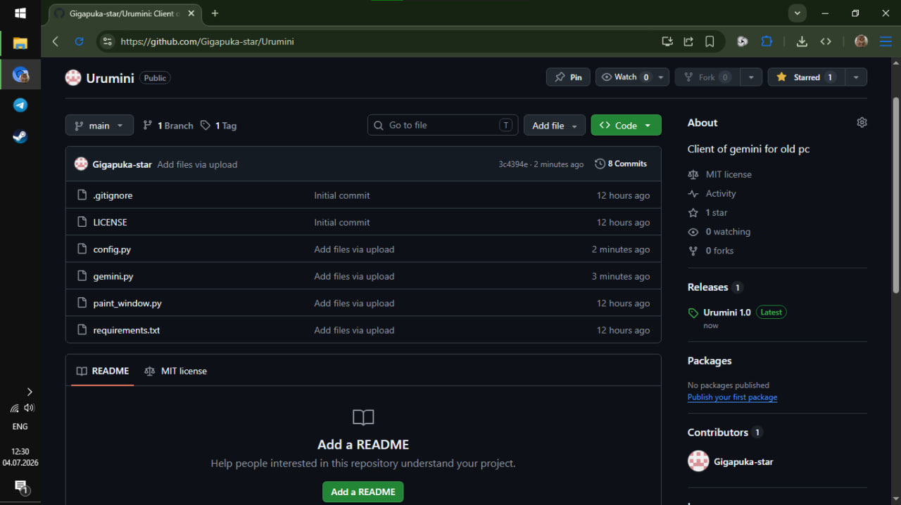
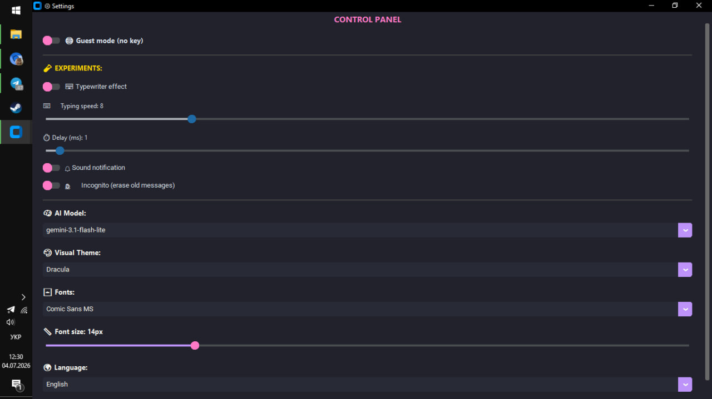

# Urumini

Urumini is a lightweight desktop client for Gemini, designed specifically for older PCs.
### Preview

### Settings Panel

### Drawing Tool
.jpg)

## Features

- Lightweight and fast performance.
- Built-in drawing tool for sketches.
- Customizable interface (Dracula theme, font settings).
- Advanced settings: typewriter effect, typing speed control, and delay adjustments.
- Privacy features: Guest mode and Incognito mode.

## Installation

1. Clone this repository:
   git clone https://github.com/Gigapuka-star/Urumini

2. Install the required dependencies:
   pip install -r requirements.txt

3. Run the main application file.

## Project Structure

- gemini.py: AI model interaction logic.
- paint_window.py: Drawing interface.
- config.py: User configuration settings.
- requirements.txt: Dependencies list.

## License

This project is licensed under the MIT License.
